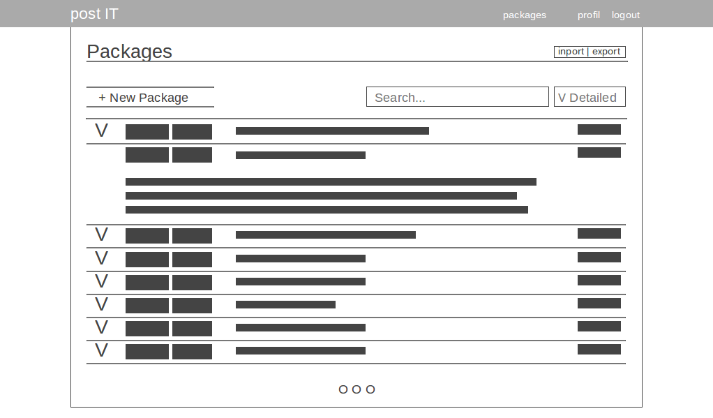

# Témalabor
### Postázási folyamatkezelő

API leírása SWAGGER segítségével:
https://app.swaggerhub.com/apis/posta1/posta/1.0.0

Feladatok nyilvántartása VSTS segítségével:
https://posta1.visualstudio.com/Posta

### Architektúra:

Frontend:
  - Angular.js
  - Bootstrap

Backend:
  - Node.js
  - Sails
  - mongodb
  
### Kezdeti tervek

