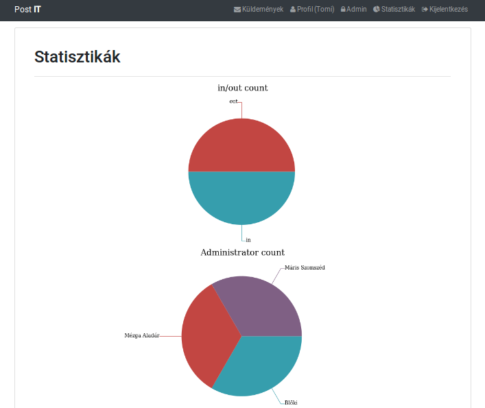

# Felhasználói dokumentáció

## Bejelentkezés

A fent látható felületen tudnak a felhasználók bejelentkezni a rendszerbe a saját felhasználónevükkel és jelszavukkal. Bejelentkezés nélkül az alkalmazás többi funkciójához nem lehetséges a hozzáférés.

Bejelentkezés után a lent látható üdvözlő felület fogadja a felhasználókat.

## Küldemények

A küldemények menüpont alatt láthatóak a rendszerben rögzített küldemények. Minden oldalon 5 tétel jelenik meg. Az adott küldeményre kattintva jelennek meg a részletes adatai. A sor végén látható ceruzára kattintva lehet szerkeszteni az adott tételt.

A rendszer többféle keresést tesz lehetővé. A keresés mezőbe írtak alapján azokat a csomagokat hagyja bent, amelyeknek az iktatószáma, a partnere vagy a tárgya tartalmazza a keresett kifejezést. Iktatószámból lehetséges több felsorolása is.

Részletes keresésre is van lehetőség, ez a Részletes gombbal hívható elő. Itt minden mezőre megfogalmazhatunk feltételeket, és a keresés gombra kattintva csak az ezeknek megfelelő küldeményeket fogja listázni.

Továbbá van még lehetőség a részletes keresések elmentésére is. Ehhez meg kell adni a szűrőfeltételeket, illetve a keresésnek egy nevet, majd a Keresés mentése gombot kell választani. Az elmentett kereséseket a legördülő listából lehet kiválasztani, melynek hatására a rendszer betölti az adott mentett keresést.

## Új küldemény létrehozása

Az új küldemények létrehozásakor tudjuk meghatározni a küldemény típusát. Ennek a választásnak megfelelően jelennek meg a felületen a különböző beviteli mezők.

## Küldemény szerkesztése

Küldemények szerkesztésekor már nem lehetséges a küldemény típusának a módosítása, továbbá a dátum is fix, de a többi paramétere tetszőlegesen módosítható.

## Profil megtekintése és szerkesztése

Minden felhasználó képes arra, hogy a profiljában szereplő adatait megváltoztassa, a felhasználóneve kivételével. Erre a Profil menüpont ad lehetőséget. Értelemszerűen a jelszó megváltoztatásához meg kell adni a jelenlegi jelszót, illetve az újat kétszer. A többi adat módosításához viszont nem szükséges a jelszó megadása.

## Admin oldal

Azok a felhasználók, akik Adminisztrátor jogosultsággal rendelkeznek, láthatják az admin menüt is. Itt lehet új felhasználókat hozzáadni a rendszerhez, továbbá az aktuális felhasználókat is listázni lehet. Továbbá a küldeményeknél megadható Divíziók és Adminisztrátorok(Ügyintézők) listája is itt bővíthető.

## Statisztikák oldal (Admin)

Adminisztrátori jogosultsággal rendelkező felhasználóknak még elérhető egy Statisztikák menü is, ahol az adatbázisban lévő küldeményekről láthatók statisztikák.

